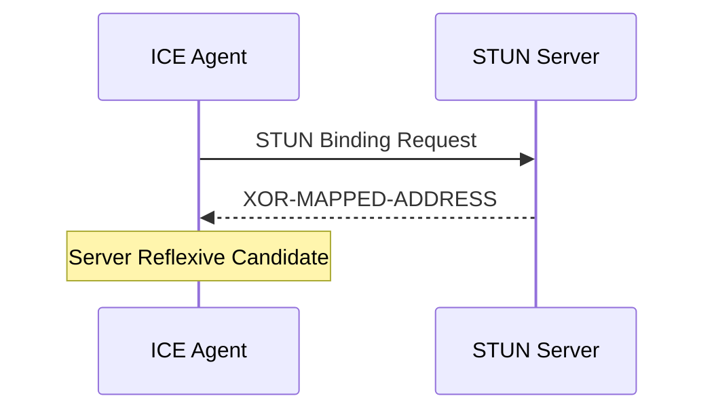
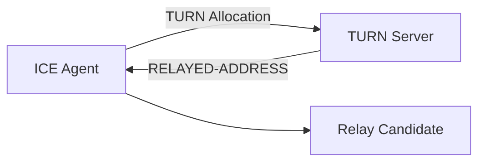
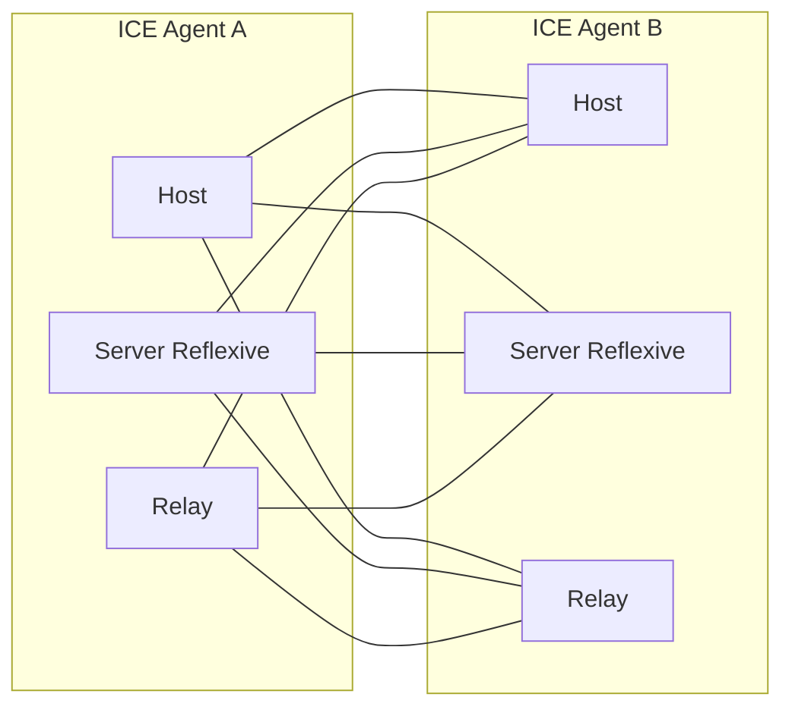
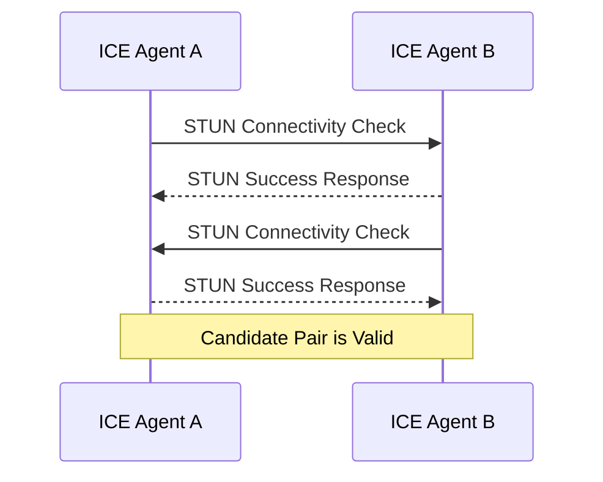
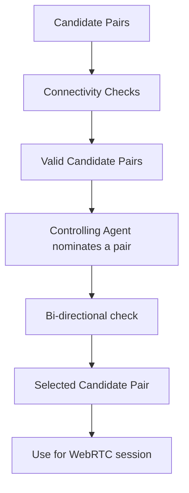
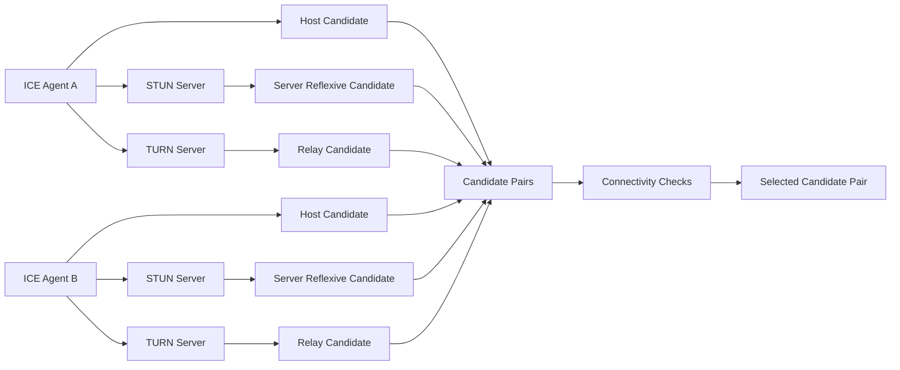
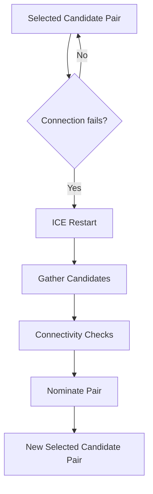

# Connecting

webrtc doesn't uses normal tcp/ip system
it's more of p2p protocol; task of creating a connection is equally distributed to both peers; cause you can't assume transport address(port and ip).
establishing p2p is not so easy; problems that can come:

- agents in diff network
- no same network protocol(UDP<-->TCP)
- diff config(IPv4<--->IPv6)

still you get some benefits also:

- reduced bandwidth: p2p hence no server sits
- low latency
- secure e2e connection

This is known as ICE protocol, it tries to find best way to communicate b/w 2 ICE Agents.
it publishes the way it is reachable known as `candidates` : transport address of the agent.
ICE then determines the best pairing of candidates.

need to understand Network behavious for ICE

## Networking real-world constraints

Problems:

- 2 agents not in same network
- protocl issues: tcp/udp blocked; very low MTU (Maximum Transmission Unit)
- Firewall rules: s/w process every packet; maybe blocked

solution: **Nat Mapping**

## NAT Mapping

This is how WebRTC allows two peers in completely different subnets to communicate,
we have Agent 1 and Agent 2 and they are in different networks.
However, traffic is flowing completely through.

we establish a NAT mapping:
Agent 1 uses port `7000` to establish a WebRTC connection with Agent 2.
binding of `192.168.0.1:7000` to `5.0.0.1:7000`

Downside:

- no single form of mapping
- inconsistent behavious across networks.
- might be disabled by network administrators.

RFC 4787 document describes these behaviours.

**Mapping Creation**: When you send a packet to an address outside your network, a mapping is created. Temp IP.
3 categories:

- **Endpoint-Independent Mapping** (One mapping is created for each sender); best case
- **Address Dependent Mapping** (new mapping for new address); not same for diff ports
- **Address & Port Dependent Mapping** new mapping for diff remote ID or port.
- **Mapping Filtering Behaviors** rules about who can use mapping:
  - Endpoint-Independent Filtering: anyone can use mapping.
  - Address Dependent Filtering : only host can use mapping; send to host A, get response from host A, ignored for host B
  - Address and Port Dependent Filtering : host and port mapped; say A:5000, then you can get anything from A:5001.

- **Mapping Refresh** if unsed for 5 minutes, destroy it.

## STUN (Session Traversal Utilities for NAT)

Protocol created only to work with NATs.
STUN is imp b/c it allows the programmatic creation of NAT Mappings.

**Structure**:

```
0                       1                   2               3
0 1 2 3 4 5 6 7 8 9 0 1 2 3 4 5 6 7 8 9 0 1 2 3 4 5 6 7 8 9 0 1
+-+-+-+-+-+-+-+-+-+-+-+-+-+-+-+-+-+-+-+-+-+-+-+-+-+-+-+-+-+-+-+-+
|0 0|               STUN Message Type |         Message Length |
+-+-+-+-+-+-+-+-+-+-+-+-+-+-+-+-+-+-+-+-+-+-+-+-+-+-+-+-+-+-+-+-+
|                           Magic Cookie                        |
+-+-+-+-+-+-+-+-+-+-+-+-+-+-+-+-+-+-+-+-+-+-+-+-+-+-+-+-+-+-+-+-+
|                                                               |
|               Transaction ID (96 bits)                        |
|                                                               |
+-+-+-+-+-+-+-+-+-+-+-+-+-+-+-+-+-+-+-+-+-+-+-+-+-+-+-+-+-+-+-+-+
|                           Data                                |
+-+-+-+-+-+-+-+-+-+-+-+-+-+-+-+-+-+-+-+-+-+-+-+-+-+-+-+-+-+-+-+-+
```

- STUN Message Type : for NAT mappng we creare a Binding Request
- Message Length : Length of Data Section;contains arbitrary data that is defined by the Message Type.
- Magic Cookie : fixed value- `0x2112A442`; distinguish b/w STUN traffic and other protocols.
- Transaction ID : 96-bit identifier for req-res.
- Data: list of STUN attributes.

```
0                   1                   2                   3
0 1 2 3 4 5 6 7 8 9 0 1 2 3 4 5 6 7 8 9 0 1 2 3 4 5 6 7 8 9 0 1
+-+-+-+-+-+-+-+-+-+-+-+-+-+-+-+-+-+-+-+-+-+-+-+-+-+-+-+-+-+-+-+-+
|                   Type        |           Length              |
+-+-+-+-+-+-+-+-+-+-+-+-+-+-+-+-+-+-+-+-+-+-+-+-+-+-+-+-+-+-+-+-+
| Value (variable) ....
+-+-+-+-+-+-+-+-+-+-+-+-+-+-+-+-+-+-+-+-+-+-+-+-+-+-+-+-+-+-+-+-+
```

STUN Binding Request has no attributes; only header
STUN Binding Response uses a XOR-MAPPED-ADDRESS (0x0020). This attribute contains an IP and port. This is the IP and port of the NAT mapping that is created!

**Create a NAT Mapping**:
via STUN takes 1 request, 1. send a STUN Binding Request to the STUN Server. 2. STUn Server responds with a STUN Binding Response 3. STUN Binding Response(Mapped Address) is used to acknowledge STUN Server and NAT Mapping. 4. Mapped Address is call Public IP or Server Reflexive Candidate.

**Determining NAT Type**:
Address dependent is not useful(will loose msg from another peer)
solution: the host that runs the STUN server can also forward packets for you to the peer or `TURN` servers

## TURN(Traversal Using Relays around NAT)

Solution when direct connectivity is not possible. can be because: either incompatible or diff protocol.
It is used for privacy purposes(obscure the client’s actual address).
Dedicated server is used(becomes proxy for client)
Client connects to server and creates an Allocation(temporary IP/Port/Protocol) : used to send traffic back to client.
This new listener is known as the `Relayed Transport Address`. forwading address so other can send traffic via TURN.
for each client new `Permission` to allow communication with you.
RTA is used to send outbound traffic via TURN.

### TURN Lifecycle

Here’s the completed version in the same concise style:

When a client wants to create a TURN Allocation:

- **Allocation**: basically a `TURN Session`; client communicates with the `TURN Server Transport Address` (usually `port 3478`).

  **req:**

  ```json
  {
    "USERNAME": "user",
    "PASSWORD": "password",
    "REQUESTED-TRANSPORT": "UDP",
    "EVEN-PORT": false
  }
  ```

  **res:**

  ```json
  {
    "XOR-MAPPED-ADDRESS": "client-ip:client-port",
    "RELAYED-ADDRESS": "turn-server-ip:relay-port",
    "LIFETIME": "600s"
  }
  ```

- **USERNAME/PASSWORD**: required for TURN authentication.

- **REQUESTED-TRANSPORT**: transport between TURN server and peer — `UDP` or `TCP`.

- **EVEN-PORT**: requests an even relay port plus the next consecutive port; generally not relevant to WebRTC.

- **XOR-MAPPED-ADDRESS**: client's public/mapped address.

- **RELAYED-ADDRESS**: the public relay address other peers send packets to.address you give to the peer.

- **LIFETIME**: how long the allocation remains alive; extend it with a `Refresh` request.

### Permissions

- **Permission**: required before a remote host can send traffic to your `Relayed Transport Address`.

  - Tells TURN server: `IP:port` is allowed to send inbound traffic.

  **req:**

  ```json
  {
    "XOR-PEER-ADDRESS": "remote-ip:remote-port"
  }
  ```

  **res:**

  ```json
  {
    "LIFETIME": "300s"
  }
  ```

- Remote host must provide the `IP:port` **as seen by the TURN server**.

- Remote host should send a `STUN Binding Request` to the **same TURN server** to determine its mapped address.

- If the mapping is obtained from a different TURN server, the permission may not match and inbound traffic is dropped.

- With **Address-Dependent Mapping**, the remote host can get a different mapped address when communicating with different hosts.

- **Permission lifetime**: `5 minutes`; must be refreshed before expiry.

### Sending Data

Two ways for a TURN client to send data to a peer:

- **Send Indication**: contains both the data and peer's `IP:port`.

  ```json
  {
    "PEER-ADDRESS": "peer-ip:peer-port",
    "DATA": "message"
  }
  ```

  Simple, but inefficient for many messages because the `IP:port` is repeated every time.

- **ChannelData**: bind a `Channel ID` to the peer's `IP:port` once, then send using only the `Channel ID`.

  ```json
  {
    "CHANNEL-ID": 1234,
    "PEER": "peer-ip:peer-port"
  }
  ```

  Then:

  ```json
  {
    "CHANNEL-ID": 1234,
    "DATA": "message"
  }
  ```

  Better for frequent/high-volume communication.

### Refreshing Allocations

- **Allocation** has a `LIFETIME`.
- When the lifetime expires, the TURN server destroys the allocation.
- Client must periodically send a `Refresh` request before expiry.

  ```json
  {
    "LIFETIME": "600s"
  }
  ```

### TURN Usage

TURN can be used with **one or two allocations**:

- **One TURN Allocation**: one peer uses TURN; the other communicates directly with it.

  ```text
  Peer A ──────── TURN Server ──────── Peer B
     TURN Allocation
  ```

- **Two TURN Allocations**: both peers use TURN, typically when direct connectivity is blocked (e.g. UDP blocked).

  ```text
  Peer A ── TURN Server ───── TURN Server ── Peer B
     Allocation                  Allocation
  ```

The key idea: **Allocation → Permission → Send data → Refresh allocation/permission as needed.**

# ICE

**ICE (Interactive Connectivity Establishment)** is the protocol WebRTC uses to find and establish the best network path between two peers.

It uses **STUN + TURN** to discover possible addresses and then performs **connectivity checks** to select a working path.

### ICE Agent

- **ICE Agent**: WebRTC endpoint participating in ICE.
- One agent is **Controlling**, the other is **Controlled**.
- **Controlling Agent** selects the final `Candidate Pair`.
- Usually, the peer sending the `Offer` is the **Controlling Agent**.

```json
{
  "agentA": "Controlling",
  "agentB": "Controlled"
}
```

- Each agent has:

  - `ufrag` → identifies/demultiplexes the ICE session.
  - `password` → authenticates STUN connectivity checks using `MESSAGE-INTEGRITY`.

```json
{
  "ufrag": "abc123",
  "password": "secret"
}
```

- These values are exchanged through the **SDP** before connectivity checks begin.

---

## Candidate Gathering

A **Candidate** is a possible network address through which an ICE agent may be reachable.

ICE can gather:

```text
Host
mDNS
Server Reflexive
Peer Reflexive
Relay
```

### 1. Host Candidate

- Direct address of a local network interface.
- Can use `UDP` or `TCP`.

```json
{
  "type": "host",
  "address": "192.168.1.10:5000",
  "protocol": "UDP"
}
```

### 2. mDNS Candidate

- Similar to a Host Candidate, but hides the local IP.
- IP is replaced with an mDNS hostname/UUID.

```json
{
  "type": "host",
  "address": "random-uuid.local:5000"
}
```

- Useful for **local IP privacy**.
- Can generally connect only when both peers can resolve/reach the mDNS address on the same network.

### 3. Server Reflexive Candidate

- Obtained using a **STUN Binding Request** to a STUN server.
- STUN server observes the client's public `IP:port`.
- The response's `XOR-MAPPED-ADDRESS` becomes the candidate.

```json
{
  "type": "srflx",
  "address": "203.0.113.10:62000"
}
```



### 4. Peer Reflexive Candidate

- Created when a connectivity check arrives from an **unknown address**.
- The peer discovers this new address and reports it back through the authenticated ICE/STUN exchange.
- Commonly caused by NAT creating a new mapping.

```json
{
  "type": "prflx",
  "address": "198.51.100.20:53000"
}
```

### 5. Relay Candidate

- Obtained from a **TURN server**.
- The TURN allocation provides a `RELAYED-ADDRESS`.
- That address becomes the Relay Candidate.

```json
{
  "type": "relay",
  "address": "turn-server-ip:relay-port"
}
```



---

## Candidate Pairing

Once both agents gather candidates, they **exchange them**.

Each local candidate is paired with each remote candidate.

```text
3 local candidates × 3 remote candidates
= 9 candidate pairs
```

A candidate pair is:

```json
{
  "local": "local-candidate",
  "remote": "remote-candidate"
}
```



---

## Connectivity Checks

- Each candidate pair is tested using **STUN connectivity-check packets**.
- The checks are authenticated using the ICE `ufrag` + `password`.
- If traffic successfully works in both directions, the pair becomes **Valid**.



---

## Candidate Selection

The process is:

```text
Candidate Pair
      ↓
Connectivity Check
      ↓
Traffic succeeds
      ↓
Valid Candidate Pair
      ↓
Controlling Agent nominates one
      ↓
Bi-directional check
      ↓
Selected Candidate Pair
```



- **Valid Pair**: connectivity was successfully demonstrated.
- **Nominated Pair**: pair chosen by the Controlling Agent.
- **Selected Pair**: nominated pair successfully confirmed by both sides.
- The **Selected Candidate Pair** carries the actual WebRTC traffic.

---

## How STUN/TURN Fit Into ICE



In short:

```text
ICE
 ├── Gather Candidates
 │    ├── Host
 │    ├── mDNS
 │    ├── Server Reflexive ← STUN
 │    ├── Peer Reflexive
 │    └── Relay ← TURN
 │
 ├── Exchange Candidates
 │
 ├── Form Candidate Pairs
 │
 ├── Connectivity Checks ← STUN
 │
 ├── Nominate Pair
 │
 └── Select Candidate Pair
      ↓
   WebRTC Traffic
```

## ICE Restart

- If the **Selected Candidate Pair** stops working, ICE can be restarted.
- Examples:

  - NAT mapping expires.
  - Network changes.
  - TURN server becomes unavailable.

- A restart performs candidate gathering and connectivity checks again.



### Core idea

```text
STUN  → discover possible public address
TURN  → provide relay address
ICE   → test all possible paths and select one
```
