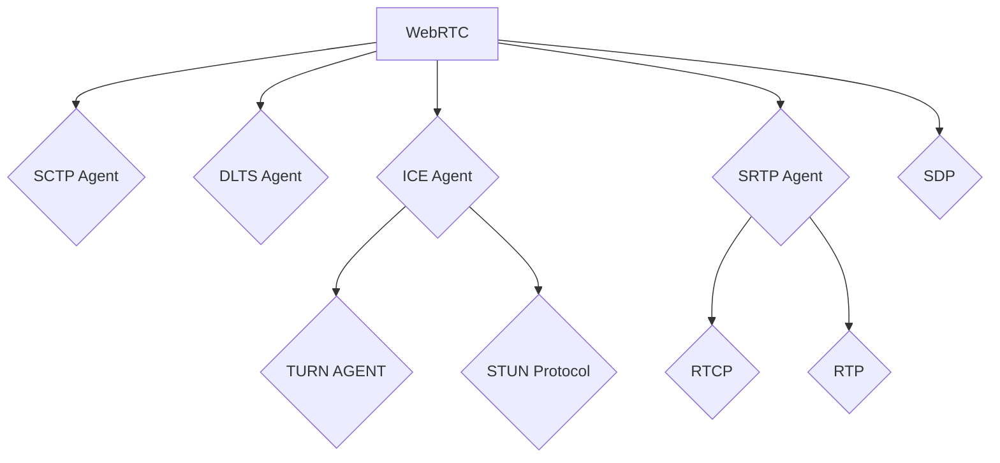

# WebRTC

it is a protocl as well as api for 2 agents to negotiate bi-directional secure real-time communication.
then as developers we utilise WebRTC API.

WebRTC is equivalent to HTTP
WebRTC API is equivalent to Fetch API.

basically break into 4 components:

1. Signaling
2. Connecting
3. Securing
4. Communicating

need each to be completed fully

## Signaling

when agents start, they have absolutely no idea who/what they are going to communicate with.
Solution: **Signaling**

Signaling uses SDP(Session Description Protocol).

```json
SDP : {
candidate IP+PORT,
no of audio+video track to send,
audio+video codec,
The values used while connecting (uFrag/uPwd).
The values used while securing (certificate fingerprint).
}
```

## Connecting and NAT Traversal with STUN/TURN

SDP exchanged then move to attempt connecting them;
we use ICE(Interactive Connectivity Establishment).

ICE: allows the establishment of a direct connection between two agents without a central server.

ICE done then move to next step
next step: establishing an encrypted transport for sharing audio, video, and data between them.

## Securing the transport layer with DTLS and SRTP

via 2 protocols:

- DTLS (Datagram Transport Layer Security) and
- SRTP (Secure Real-Time Transport Protocol)

DLTS= UDP + TLS
SRTP= ensure encryption of RTP(Real-time Transport Protocol) data packets

1. WebRTC connects by doing a DTLS handshake over the connection established by ICE.
   not like HTTPS(central authority); simply asserts that the certificate exchanged via DTLS matches the fingerprint shared via signaling.
   This DTLS connection is then used for DataChannel messages.

2. WebRTC uses the RTP protocol, secured using SRTP, for audio/video transmission. init SRTP session by extracting the keys from the
   negotiated DTLS session.

3. done

## Communicating with peers via RTP and SCTP

2 protocols:

- RTP to exchange media encrypted with SRTP
- SCTP to send and receive DataChannel messages encrypted with DTLS.

# WebRTC

it is not like over engineered, instead it's like clubbing single tech into an applicable bundle.
`WebRTC Agent` is really just an orchestrator of many different protocols.



## API

so WebRTC JS API map to WebRTC protocols.

| API                          | Use case in a couple sentences                                                                                                                                                                                                                                       |
| ---------------------------- | -------------------------------------------------------------------------------------------------------------------------------------------------------------------------------------------------------------------------------------------------------------------- |
| `new RTCPeerConnection()`    | Allocates the whole session container — ICE, DTLS, SRTP, SCTP subsystems all get created but stay idle. Nothing is sent or negotiated until you start calling the methods below.                                                                                     |
| `addTrack()`                 | Registers a media stream (audio/video) on the connection. Generates an SSRC and a media section that will appear in the next SDP you generate, and once SRTP is up, that track's packets flow encrypted over ICE.                                                    |
| `createDataChannel()`        | Requests an SCTP association for arbitrary data (not audio/video) if one doesn't exist yet. SCTP only turns on because you asked for it — no data channel, no SCTP traffic at all.                                                                                   |
| `createOffer()`              | Produces a text description (SDP) of your local state — tracks, data channels, codecs — as it currently stands. Purely read-only: calling it doesn't commit or change anything locally.                                                                              |
| `setLocalDescription()`      | Commits everything you staged with `addTrack`/`createDataChannel` — before this call those were provisional. You call it with the SDP `createOffer` gave you, then ship that SDP to the remote peer over your signaling channel.                                     |
| `setRemoteDescription()`     | Tells your local agent what the _other_ peer's SDP says — this is literally what "signaling" means at the API level. Once both sides have called this, both agents have enough info to start ICE connectivity checks.                                                |
| `addIceCandidate()`          | Feeds one more discovered network path (from the remote peer, relayed via signaling) into your local ICE agent. Doesn't touch anything else — purely hands a candidate to ICE for it to try pairing.                                                                 |
| `ontrack`                    | Fires when an incoming RTP packet's SSRC matches a media section you already learned about via `setRemoteDescription`. WebRTC resolves it to a `MediaStream`/`MediaStreamTrack` and hands it to you — this is how you get the remote video/audio to actually render. |
| `oniceconnectionstatechange` | Fires whenever your ICE agent's state changes (checking → connected → disconnected → failed, etc). This is your window into raw network health — the thing to watch when you're deliberately killing wifi to see what breaks.                                        |
| `onconnectionstatechange`    | Rolls up ICE state _and_ DTLS state into one signal — fires `"connected"` only once both the network path and the encryption handshake have succeeded. This is usually the one you actually gate your UI on ("call connected"), not the ICE-only event.              |
