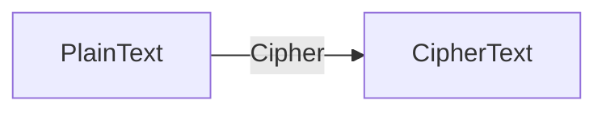
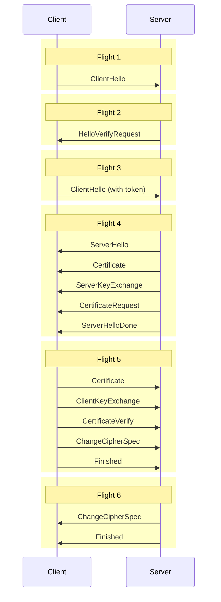
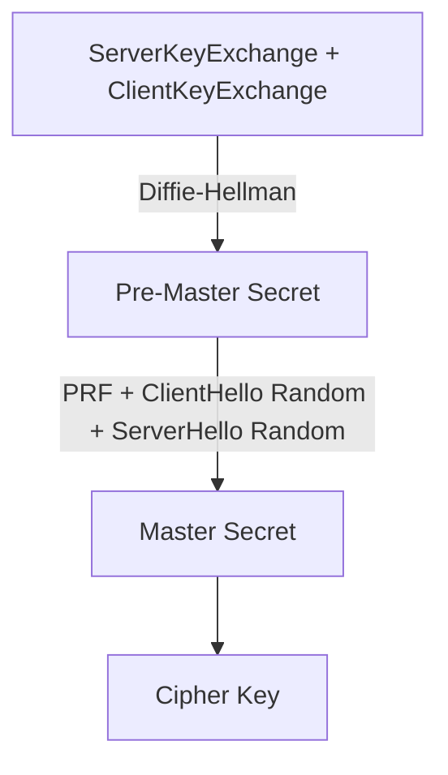

# Securing

No in built security. Anyone can do MITM attack and change data.

we know it has 2 protocol: Datagram Transport Layer Security (DTLS) and the Secure Real-time Transport Protocol (SRTP)
DTLS uses UDP instead of TCP as the transport layer.
SRTP is designed for exchanging media securely.

1. DLTS: does a handshake over the connection provided by ICE. client/server protocol. TCP handshake, offers a certificate,

2. check with certificate hash in the Session Description. this is to ensure that handshake happened with Agent.

3. Init the session by using the keys generated by DLTS. once done, media is encrypted using SRTP.

# Working

works on 2 protocol: Datagram Transport Layer Security (DTLS) and the Secure Real-time Transport Protocol (SRTP).
DLTS allow to negotiate session and then exchange data securely.
Uses UDp. SRTP is it's own optimisation.

DLTS does handshake over ICE, both (client, server) use it, then offer a certificate. Use certificate to compared to the certificate hash in the Session Description.(ensures handshake happened with WebRTC Agent)

SRTP Session: init via Keys by DLTS.

# Security 101

understand these terms first:

Cipher is also known as Encrypting and Decrypting.

Hash, same as cipher but only one way
not reversible.

Public Private KeyPair
public Key to encrypt
private to decrypt

private key can't be shared.

Diffie–Hellman exchange is the solution we use.

A Pseudorandom Function (PRF) is a pre-defined function to generate a value that appears random. It may take multiple inputs and generate a single output.

Key Derivation is a function that is used to make a key stronger.

cipher + nonce= diff output each time.

Message Authentication Code(MAC) proves that the message comes from the user you expected.

Key Rotation: update key regularly.

# DTLS (Datagram Transport Layer Security)

allows two peers to establish secure communication with no pre-existing configuration.
Eavsdropping is also of no use.
Cipher+Key is needed. determined via DLTS Handshake.

## Packet Format

Every DTLS packet starts with a header.

**Content Type** You can expect the following types:

- 20 - Change Cipher Spec
- 22 - Handshake
- 23 - Application Data

Handshake is used to exchange the details to start the session. Change Cipher Spec is used to notify the other side that everything will be encrypted. Application Data are the encrypted messages.

**Version** Version can either be 0x0000feff (DTLSv1.0) or 0x0000fefd (DTLSv1.2) there is no v1.1.

**Epoch** The epoch starts at 0, but becomes 1 after a Change Cipher Spec. Any message with a non-zero epoch is encrypted.

**Sequence Number** Sequence Number is used to keep messages in order. Each message increases the Sequence Number. When the epoch is incremented, the Sequence Number starts over.

**Length and Payload** The Payload is Content Type specific. For Application Data the Payload is the encrypted data. For Handshake it will be different depending on the message. The length is for how big the Payload is.

## Handshake State Machine

During the handshake, the Client/Server exchanges a series of messages. These messages are grouped into flights. Each flight may have multiple messages in it (or just one). A Flight is not complete until all the messages in the flight have been received. We will describe the purpose of each message in greater detail below.

**ClientHello** ClientHello is the initial message sent by the client. It contains a list of attributes. These attributes tell the server the ciphers and features the client supports. For WebRTC this is how we choose the SRTP Cipher as well. It also contains random data that will be used to generate the keys for the session.

**HelloVerifyRequest** HelloVerifyRequest is sent by the server to the client. It is to make sure that the client intended to send the request. The Client then re-sends the ClientHello, but with a token provided in the HelloVerifyRequest.

**ServerHello** ServerHello is the response by the server for the configuration of this session. It contains what cipher will be used when this session is over. It also contains the server random data.

**Certificate** Certificate contains the certificate for the Client or Server. This is used to uniquely identify who we were communicating with. After the handshake is over we will make sure this certificate when hashed matches the fingerprint in the SessionDescription.

**ServerKeyExchange/ClientKeyExchange** These messages are used to transmit the public key. On startup, the client and server both generate a keypair. After the handshake these values will be used to generate the Pre-Master Secret.

**CertificateRequest** A CertificateRequest is sent by the server notifying the client that it wants a certificate. The server can either Request or Require a certificate.

**ServerHelloDone** ServerHelloDone notifies the client that the server is done with the handshake.

**CertificateVerify** CertificateVerify is how the sender proves that it has the private key sent in the Certificate message.

**ChangeCipherSpec** ChangeCipherSpec informs the receiver that everything sent after this message will be encrypted.

**Finished** Finished is encrypted and contains a hash of all messages. This is to assert that the handshake was not tampered with.

## Key Generation

After the Handshake is complete, you can start sending encrypted data. The Cipher was chosen by the server and is in the ServerHello. How was the key chosen though?

First we generate the Pre-Master Secret. To obtain this value Diffie-Hellman is used on the keys exchanged by the ServerKeyExchange and ClientKeyExchange. The details differ depending on the chosen Cipher.

Next the Master Secret is generated. Each version of DTLS has a defined Pseudorandom function. For DTLS 1.2 the function takes the Pre-Master Secret and random values in the ClientHello and ServerHello. The output from running the Pseudorandom Function is the Master Secret. The Master Secret is the value that is used for the Cipher.

## Exchanging Application Data

The workhorse of DTLS is ApplicationData. Now that we have an initialized cipher, we can start encrypting and sending values.

ApplicationData messages use a DTLS header as described earlier. The Payload is populated with ciphertext. You now have a working DTLS Session and can communicate securely.

DTLS has many more interesting features like renegotiation. They are not used by WebRTC, so they will not be covered here.
